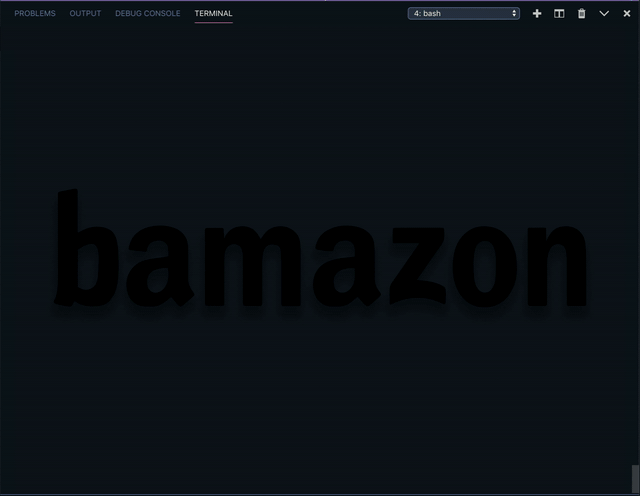

---
### Welcome to bamazon, a CLI inventory management app that features two account types: customer and manager.  
---
### Table of Contents
  * [Design Process](#design-process)
  * [Technologies](#technologies)
  * [Features And Functionality](#features-and-functionality)
  * [File Architecture](#file-architecture)
  * [Setup](#setup)
---

## Design Process
   
> The theme for this app was inspired by 1970's Wacky Packages trading cards featuring parodies of consumer products. 
---

## Technologies
> <b>Design Tools:</b>
  * Adobe Illustrator
  * Adobe Photoshop
  
> <b>Development Tools:</b>
  * <b>Chalk:</b> Command line styling 
  * <b>Colors:</b> Command line styling
  * <b>Cli-table3:</b> Command line table styling 
  * <b>MYSQL:</b> Database to store bamazon's inventory information 
  * <b>Inquirer:</b> Command line query prompt 
  * <b>Joi:</b> Query validation  
---

## Features And Functionality
> <b>Customer Account:</b> bamazon allows customers to place orders and then depletes stock from the store's inventory.
  * App Commands: 
    * View Products for Sale
    * Purchase Items
    * View Cart
    * Checkout 
    * Exit 
  * <details><summary><b>Click to Expand Customer View - Demo Video</b></summary>
    
    </details>
  
> <b>Manager Account:</b> bamazon allows managers to view, update and add products to the store's inventory.
  * App Commands:
    * View Products for Sale
    * View Low Inventory
    * Update Product Quantities
    * Add New Products 
    * Exit
  * <details><summary><b>Click to Expand Manager View - Demo Video</b></summary>
    
    </details>
---

## File Architecture 
    
    bamazon
    ├── assets
    │   ├── bamazon_logo.svg
    │   ├── bamazon_manager_view.gif  
    │   ├── bamazon_products.svg 
    │   └── bamazon.gif
    ├── node_modules
    ├── .gitignore
    ├── bamazon_db.sql
    ├── bamazon_workbench.sql
    ├── bamazonCustomer.js
    ├── bamazonManager.js
    ├── package.json
    └── README.md
   

---

## Setup

> This application is only functional through the command line. Follow the steps below to test it out. 

```
1. $ git clone https://github.com/JAE-S/Bamazon.git
2. $ npm install
  
3.(a) To Test The Customer Account Run: $ node bamazonCustomer.js
3.(b) To Test The Manager Account Run: $ node bamazonManager.js
```


[Back To Top](#table-of-contents)