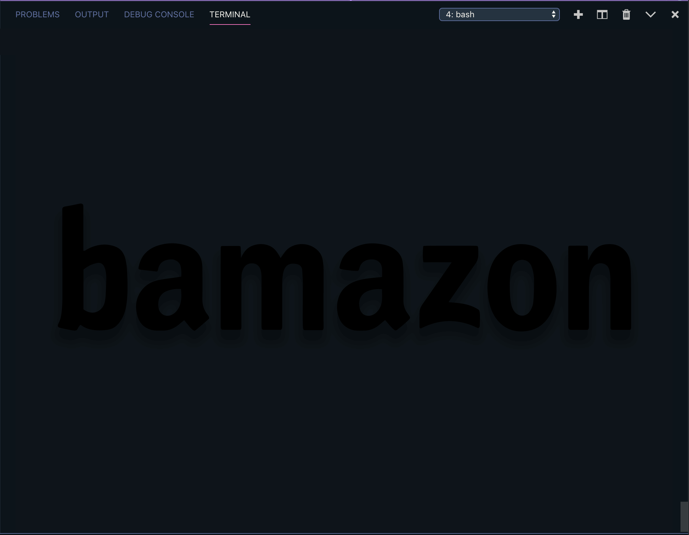

---
# Welcome to bamazon

'bamazon' is a CLI inventory management app that was created with Node.JS and MySQL. The theme for this app was inspired by 1970's Wacky Packages trading cards featuring parodies of consumer products. 


```
 bamazon allows customers to place orders and then depletes stock from the store's inventory.
```
---
### Customer View - Demo Video 


*App Commands*
```
- View Products for Sale
- Purchase Items
- View Cart
- Checkout 
- Exit 
```

---
### Manager View - Demo Video 


*App Commands*
```
- View Products for Sale
- View Low Inventory
- Update Product Quantities
- Add New Products 
- Exit 
```

*Node Packages*
```
- Chalk 
- Colors
- MYSQL
- Inquirer
- Cli-table3
- Joi
```